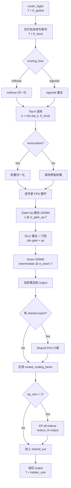

# FusedMoEImpl API 参数说明

> **Reference-path document.** `FusedMoEImpl` 是纯 PyTorch 参考实现，不是当前
> SVE BF16 fused kernel、`MoePlannerRuntime` 或 Plan V2 production path。本文
> 用于 API/数值对照，不提供当前 kernel、cost model 或 planner 的性能证据。
> production 集成见
> [`../../../docs/vllm_bf16_tiled_moe_integration.md`](../../../docs/vllm_bf16_tiled_moe_integration.md)，
> 论文状态见
> [`../../../docs/moe_paper_readiness.md`](../../../docs/moe_paper_readiness.md)。

## 概述

`FusedMoEImpl` 是一个纯 PyTorch 实现的 Mixture of Experts（MoE）模块，支持 **Full-Token Expert Parallelism（全量 Token EP）** 优化。每个 EP 节点持有完整的 token batch，仅计算其本地专家子集，从而消除 token dispatch 通信开销。

---

## 1. `__init__` 构造函数参数

### 1.1 MoE 架构参数

| 参数 | 类型 | 说明 |
| --- | --- | --- |
| `num_experts` | `int` | **全局**专家总数（如 DeepSeek V2 为 64，V3 为 256）。必须能被 `ep_size` 整除。在 EP 模式下，每个节点持有 `num_experts // ep_size` 个本地专家。 |
| `top_k` | `int` | 每个 token 选择的专家数量（如 DeepSeek V2/V3 为 6 或 8）。实际选择数为 `min(top_k, local_num_experts)`。 |
| `hidden_size` | `int` | 模型隐藏层维度（如 5120）。即 `hidden_states` 最后一维的大小，也是专家 FFN 的输入/输出维度。 |
| `ffn_hidden_size` | `int` | 专家 FFN 的中间层维度（如 12288）。Gate 和 Up 投影的输出维度均为此值，经过 SiLU 激活后 Down 投影将其映射回 `hidden_size`。 |

### 1.2 专家权重

| 参数 | 类型 | Shape | 说明 |
| --- | --- | --- | --- |
| `w_gate` | `torch.Tensor` | `[num_experts, ffn_hidden_size, hidden_size]` | Gate 投影权重。对应 vllm 中 `w13_weight[:, :ffn_hidden_size, :]`（即 `w13` 的前半部分）。构造时会与 `w_up` 拼接为 `w_gate_up`。 |
| `w_up` | `torch.Tensor` | `[num_experts, ffn_hidden_size, hidden_size]` | Up 投影权重。对应 vllm 中 `w13_weight[:, ffn_hidden_size:, :]`（即 `w13` 的后半部分）。构造时会与 `w_gate` 拼接为 `w_gate_up`。 |
| `w_down` | `torch.Tensor` | `[num_experts, hidden_size, ffn_hidden_size]` | Down 投影权重。对应 vllm 中 `w2_weight`。将中间层 `ffn_hidden_size` 映射回 `hidden_size`。 |

> **vllm 权重布局映射**：vllm 将 gate 和 up 融合存储为 `w13_weight: [E, 2F, H]`，down 存储为 `w2_weight: [E, H, F]`。提取方式：
> ```python
> w_gate = w13_weight[:, :ffn_hidden_size, :]
> w_up   = w13_weight[:, ffn_hidden_size:, :]
> w_down = w2_weight
> ```

### 1.3 Expert Parallelism（EP）参数

| 参数 | 类型 | 默认值 | 说明 |
| --- | --- | --- | --- |
| `ep_size` | `int` | `1` | EP 并行的总节点数。`ep_size=1` 表示单节点推理（所有专家在本地）。`ep_size > 1` 时启用 Full-Token EP 模式。 |
| `ep_rank` | `int` | `0` | 当前 EP 节点的编号（0-indexed）。必须满足 `0 <= ep_rank < ep_size`。用于确定本地专家范围：`[ep_rank * local_num_experts, (ep_rank + 1) * local_num_experts)`。 |
| `reduce_fn` | `Optional[Callable[[torch.Tensor], torch.Tensor]]` | `None` | EP all-reduce 回调函数。`ep_size > 1` 时，在 routed expert 输出上调用此函数进行跨节点聚合（如 `torch.distributed.all_reduce`）。`None` 时跳过 all-reduce。 |

### 1.4 路由参数

| 参数 | 类型 | 默认值 | 说明 |
| --- | --- | --- | --- |
| `renormalize` | `bool` | `False` | 是否对 top-k 权重重新归一化（使其和为 1）。`True` 时：`topk_weights = topk_weights / topk_weights.sum(dim=-1, keepdim=True)`。 |
| `scoring_func` | `str` | `"softmax"` | 路由评分函数，支持 `"softmax"` 和 `"sigmoid"` 两种。`"softmax"` 在所有**本地**专家上做 softmax 归一化；`"sigmoid"` 对每个专家独立做 sigmoid。 |
| `routed_scaling_factor` | `float` | `1.0` | 路由输出的缩放因子。DeepSeek V3 使用此参数（如 `routed_scaling_factor=2.5`）来平衡 routed expert 和 shared expert 的贡献。具体行为取决于 dtype：<br>• **非 FP16**：`output *= routed_scaling_factor`<br>• **FP16 + 有 shared expert**：`shared_out *= 1.0 / routed_scaling_factor`（避免 FP16 溢出） |

### 1.5 Shared Expert 参数（可选）

| 参数 | 类型 | 默认值 | 说明 |
| --- | --- | --- | --- |
| `shared_expert_gate` | `Optional[torch.Tensor]` | `None` | Shared expert 的 Gate 投影权重，shape = `[shared_ffn_hidden, hidden_size]`。对应 vllm 中 `shared_experts.gate_up_proj.weight[:shared_intermediate, :]`。 |
| `shared_expert_up` | `Optional[torch.Tensor]` | `None` | Shared expert 的 Up 投影权重，shape = `[shared_ffn_hidden, hidden_size]`。对应 vllm 中 `shared_experts.gate_up_proj.weight[shared_intermediate:, :]`。 |
| `shared_expert_down` | `Optional[torch.Tensor]` | `None` | Shared expert 的 Down 投影权重，shape = `[hidden_size, shared_ffn_hidden]`。对应 vllm 中 `shared_experts.down_proj.weight`。 |

> **注意**：`shared_expert_gate` 和 `shared_expert_up` 必须同时提供或同时为 `None`。构造时会将两者拼接为 `shared_gate_up: [2 * shared_ffn_hidden, hidden_size]` 以实现单次矩阵乘法。Shared expert 的输出在 EP all-reduce **之后**加到最终结果上（因为 shared expert 在每个节点上独立计算，无需聚合）。

---

## 2. 内部存储属性

构造函数会基于输入参数计算并存储以下内部属性：

| 属性 | 类型 | 说明 |
| --- | --- | --- |
| `local_num_experts` | `int` | 本地专家数 = `num_experts // ep_size` |
| `expert_start` | `int` | 本地专家的全局起始 ID = `ep_rank * local_num_experts` |
| `expert_end` | `int` | 本地专家的全局结束 ID（不含）= `expert_start + local_num_experts` |
| `w_gate_up` | `torch.Tensor` | 融合后的 Gate+Up 权重，shape = `[num_experts, 2 * ffn_hidden_size, hidden_size]`。由 `torch.cat([w_gate, w_up], dim=1)` 生成。 |
| `w_down` | `torch.Tensor` | Down 投影权重（直接存储），shape = `[num_experts, hidden_size, ffn_hidden_size]` |
| `shared_gate_up` | `torch.Tensor \| None` | 融合后的 Shared Gate+Up 权重，shape = `[2 * shared_ffn_hidden, hidden_size]`。为 `None` 时表示无 shared expert。 |
| `shared_expert_down` | `torch.Tensor \| None` | Shared Down 投影权重，shape = `[hidden_size, shared_ffn_hidden]` |

### Property 访问器

为保持向后兼容，提供以下只读 property 从融合权重中切片返回原始权重：

| Property | 返回类型 | 说明 |
| --- | --- | --- |
| `w_gate` | `torch.Tensor` | `w_gate_up[:, :ffn_hidden_size, :]` — Gate 权重切片 |
| `w_up` | `torch.Tensor` | `w_gate_up[:, ffn_hidden_size:, :]` — Up 权重切片 |
| `shared_expert_gate` | `torch.Tensor \| None` | `shared_gate_up[:half, :]` — Shared Gate 权重切片 |
| `shared_expert_up` | `torch.Tensor \| None` | `shared_gate_up[half:, :]` — Shared Up 权重切片 |

---

## 3. `forward` 前向计算参数

```python
def forward(
    self,
    hidden_states: torch.Tensor,
    router_logits: torch.Tensor,
) -> torch.Tensor:
```

### 3.1 参数详解

| 参数 | 类型 | Shape | 说明 |
| --- | --- | --- | --- |
| `hidden_states` | `torch.Tensor` | `[total_tokens, hidden_size]` | 输入隐藏状态（来自 MLA 注意力层的输出）。`total_tokens` 是当前 batch 中所有 token 的总数。 |
| `router_logits` | `torch.Tensor` | `[total_tokens, num_experts]` | **全局**路由 logits（未经 softmax/sigmoid）。由 router 线性层（`gate`）计算得到：`router_logits = F.linear(hidden_states, W_router)`。注意这里是全局专家数维度，EP 模式下会在 forward 内部切片到本地专家列。 |

**返回值**: `torch.Tensor`，shape = `[total_tokens, hidden_size]`，经过完整 MoE 计算后的输出。

### 3.2 前向计算流程



### 3.3 计算细节

#### Step 1: 本地路由切片
```python
local_logits = router_logits[:, expert_start:expert_end]
```
仅取属于本 EP 节点的专家列，保证 softmax/sigmoid 在本地专家集上计算。

#### Step 2: 评分 + Top-k
```python
scores = softmax(local_logits) 或 sigmoid(local_logits)
topk_weights, topk_ids = topk(scores, k=min(top_k, local_num_experts))
```
`topk_ids` 是**本地**专家索引（0-based，范围 `[0, local_num_experts)`）。

#### Step 3: 逐专家 FFN
对每个本地专家 `e`，找到选中该专家的 token，执行：
```
gate_up = x @ w_gate_up[e].T          # [tokens, 2 * ffn_hidden]
gate, up = gate_up.chunk(2, dim=-1)
intermediate = silu(gate) * up         # SwiGLU 激活
expert_out = intermediate @ w_down[e].T  # [tokens, hidden_size]
```

#### Step 4: 加权累加
对每个 top-k 位置 `ki`，将 `expert_out * topk_weights[:, ki]` 累加到 `output`。

#### Step 5: Shared Expert（可选）
```
shared_out = silu(x @ shared_gate.T) * (x @ shared_up.T) @ shared_down.T
```
Shared expert 对所有 token 无条件计算，不经过路由。

#### Step 6: Scaling + All-Reduce
- 应用 `routed_scaling_factor`（FP16 时特殊处理以避免溢出）
- EP all-reduce（仅 routed expert 输出）
- 加上 shared expert 输出

---

## 4. 与 vllm `CPUFusedMOE` 的对比

| 特性 | `FusedMoEImpl`（fused_cpp） | `CPUFusedMOE`（vllm） |
| --- | --- | --- |
| **依赖** | 纯 PyTorch，无框架依赖 | 依赖 vllm `_custom_ops`、`torch.ops._C` |
| **路由** | 内置简单 local softmax/sigmoid + top-k | 外部 `select_experts` / `grouped_topk`（支持分组路由、`e_score_correction_bias`） |
| **EP 模式** | 本地切片路由（local slice → local scoring → local top-k） | Full-token EP（全局路由 → 本地过滤）或 `expert_map` 映射 |
| **FFN 计算** | 纯 PyTorch 矩阵乘法循环 | 支持 grouped GEMM（AMX/VEC）或 OneDNN 加速 |
| **Shared Expert** | 内置支持 | 在模型层（`DeepseekV2MoE`）中处理 |
| **激活函数** | 固定 SiLU（SwiGLU） | 支持 SiLU 和 SwigluOAI |
| **适用场景** | 独立测试、可移植性验证、参考实现 | 生产推理 |
